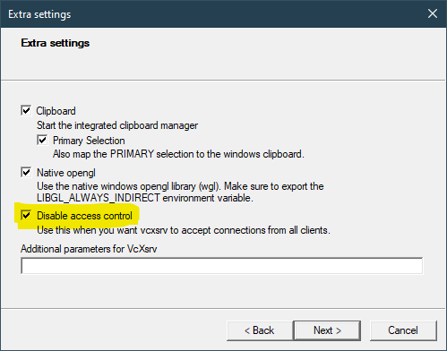

# Integration Tests

This project uses [Cypress](https://www.cypress.io/) for end-to-end integration testing.

## Running Integration Tests

Cypress is configured to run inside a Docker container. You must have Docker installed and set to use Linux hosts.

```bash
yarn test:integration
```

The docker container comes pre-configured with Chrome, Firefox, and Edge. The installed browsers will periodically
auto-update inside the docker container in the same way they do by default for end users. This may occasionally
lead to flaky tests.

## Cypress GUI Configuration

Cypress provides a GUI. It may be started using the `cypress` task:

```bash
yarn cypress
```

Once the GUI is running, the production NextJs server will continue running until it is stopped manually. If somebody
would like to figure out how to coordinate shutting down the GUI with shutting down the production server, I would
appreciate it.

The GUI is _optional_; you should be able to run tests and generate screenshots and videos without the GUI.
However, it can be helpful when working with the tests, as it lets you run the exact browsers that are being tested.

The Cypress GUI requires a running X Server.

If you are running under Linux, you are probably good to go.

If you are running WSL2 on a Windows 11 insider's build, you should use WSLg.

If you are running under WSL1, you must upgrade to WSL2.

If you are running under WSL2 on Windows 10, you must install an X Server. I recommend `VcXsrv` which can be installed
using chocolatey:

```ps
choco install VcXsrv
```

When configuring VcXsrv, it will need to accept connections from inside a Docker container. To enable this, check the
`Disable access control` option when starting VcXsrv:



You must also configure your WSL2 installation to use your new X Server. To do this, add the following line to
your `~/.bashrc` file:

```bash
export DISPLAY=$(awk '/nameserver / {print $2; exit}' /etc/resolv.conf 2>/dev/null):0
```
